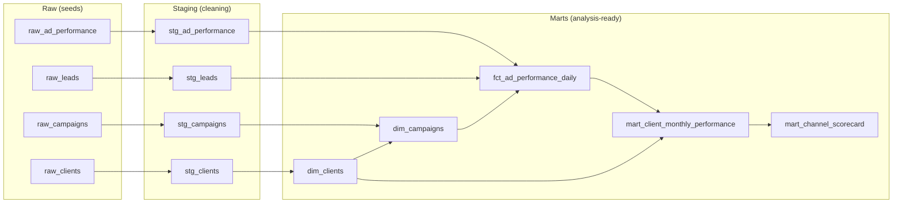

# Marketing Performance Model (dbt + DuckDB)

An analytics-engineering project for a fictional multi-client marketing agency serving construction and property clients. It turns messy ad-platform exports and CRM leads into a tested, documented data model that answers the question every agency is asked: **which channels actually make our clients money?**

> **Data disclosure:** all data is **synthetic**. The clients are fictional, and the channel benchmarks (click rates, cost per click, conversion rates, deal sizes) are illustrative assumptions, not real market figures. The project demonstrates the *method*. The numbers are not industry insights.

## Business questions

1. What did each client spend, and what did it produce (leads, won deals, revenue)?
2. Which channel gives the best return on ad spend for each type of client?
3. Which client-channel combinations lost money on ads?
4. How are total spend, leads and cost per lead trending month by month?

## Data flow



| Layer | Purpose |
|---|---|
| **Seeds** | Raw CSVs, generated by `src/generate_raw_data.py`. In a real agency these would come from ad-platform exports and a CRM. |
| **Staging** | One model per raw table: standardise labels, remove duplicates, fix impossible values. No business logic. |
| **Marts** | Dimensions and a daily fact table, then reporting tables the dashboard reads. |

## Cleaning rules (staging layer)

| Problem in the raw data | Treatment |
|---|---|
| Channel spelled many ways (`google ads`, `Facebook/Instagram`, `linkedin`) | Mapped to four standard channels |
| Lead stage with mixed case and stray spaces (`won `, `WON`) | Trimmed and standardised |
| Duplicate campaign-day rows | Kept the first row per campaign per day |
| Clicks greater than impressions (impossible) | Clicks capped at impressions, so the day's spend and leads are kept |

## Metrics

| Metric | Definition |
|---|---|
| CTR | clicks ÷ impressions |
| Cost per click | spend ÷ clicks |
| Cost per lead (CPL) | spend ÷ leads |
| Lead-to-win rate | won deals ÷ leads |
| Return on ad spend (ROAS) | won revenue ÷ ad spend (excludes the agency retainer) |

**Attribution rule:** leads and won revenue are credited to the day the **lead was created**, not the day the deal closed. This is a cohort view that ties revenue back to the spend that generated it. Leads created recently may not have closed yet, so the most recent months understate revenue.

All ratios use a reusable `safe_divide` macro (`macros/safe_divide.sql`), which returns blank instead of an error when the denominator is zero.

## Tests (42 checks run by `dbt build`)

- **Schema tests:** unique and not-null keys, accepted values for channel, segment and lead stage, and relationships between tables.
- **Custom generic test:** `non_negative` (`tests/generic/`), applied to spend, impressions and revenue.
- **Singular tests** (`tests/`):
  - spend in the fact table reconciles to staging
  - lead counts reconcile, so no leads are lost in joins
  - no campaign has two rows for the same day
  - clicks never exceed impressions

## Run it

Requires **Python 3.10 or newer** (check with `python3 --version`).

```bash
python3 -m venv .venv && source .venv/bin/activate     # Windows: .venv\Scripts\activate
pip install -r requirements.txt
python src/generate_raw_data.py     # optional: regenerates the seed CSVs
dbt build                           # loads seeds, builds models, runs all tests
python src/export_marts.py          # writes CSVs to /exports for Tableau Public
dbt docs generate && dbt docs serve # opens the documentation site and lineage graph
```

The example business queries are in `analyses/`. Run `dbt compile` and find the runnable SQL in `target/compiled/`.

## Key findings

> *Write these yourself after building the dashboard. Three to five plain sentences, each with a number, for example: "For contractors, the property portal returned R__ for every R1 of ad spend, against R__ on Google Ads." Label them as findings from the synthetic dataset.*

## Limitations

- Synthetic data: the relationships were designed, not observed.
- Cohort attribution means recent lead cohorts have not fully closed.
- No multi-touch attribution: each lead belongs to exactly one campaign.
- ROAS uses deal value, not profit.

## Next steps

- [ ] Build the Tableau Public dashboard (`docs/dashboard_plan.md`) and add a screenshot and link here
- [ ] Add a `dbt docs` lineage screenshot to this README
- [ ] Add incremental loading for the daily fact table
